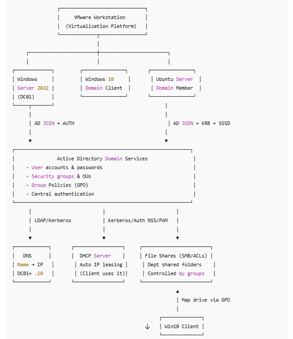

# Enterprise-IT-Infrastructure-Lab

**Objective:**
Build a production-style enterprise network in a virtual lab using Windows Server and Linux

**Technologies Used**
VMware Workstation
Windows Server 2022
Active Directory Domain Services
DNS + DHCP
Group Policy
Ubuntu Server (Kerberos + SSSD)
NTFS / SMB file sharing
Windows Backup
Event Viewer + Audit logging

**Architecture**

**Features Implemented**
Domain Controller deployment
DNS + DHCP configuration
Organizational Units + Users + Groups
Group Policy access control
Role-based file permissions
Windows client domain join
Ubuntu AD integration
Security logging & auditing
Backup + restore validation

**Challenge 1 — VM Networking Not Working**
S — Situation
I deployed multiple VMs (Windows Server, Windows 10, Ubuntu), but they couldn’t communicate or access the internet.
T — Task
Ensure all machines could talk to each other internally and Ubuntu could reach the internet to install required packages.
A — Action
Configured two VM networks:
•	Host-Only → internal LAN for AD communication
•	NAT → external internet access
R — Result
All machines communicated properly, Ubuntu downloaded packages, and I continued building the domain environment successfully.

**Challenge 2 — DNS Prevented Domain Join**
S — Situation
Windows and Ubuntu repeatedly failed to join the domain due to DNS errors like SERVFAIL and “No such realm found”.
T — Task
Fix name resolution so both systems could locate the domain controller.
A — Action
•	Set 192.168.10.10 (Domain Controller) as DNS on all machines
•	Updated netplan and /etc/resolv.conf in Ubuntu
•	Restarted SSSD and network services
R — Result
Both the Windows client and Ubuntu successfully joined the domain and authenticated users.

